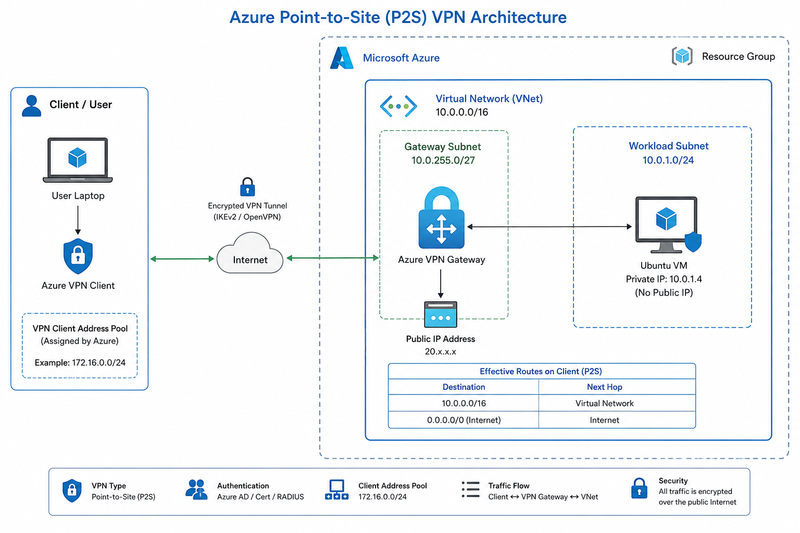

# Azure Secure Remote Access using Point-to-Site VPN with Microsoft Entra ID

Enterprise-style implementation of Azure Point-to-Site (P2S) VPN, using **Microsoft Entra ID** authentication to securely reach a private Azure Virtual Machine — without ever exposing it to the public Internet.



## Overview

Most beginner Azure labs give a VM a public IP and open ports for RDP/SSH — which is convenient but insecure. This project instead builds a **private, identity-authenticated remote access path**:

```
Laptop → Azure VPN Client → Microsoft Entra ID (auth) → Public IP → VPN Gateway → GatewaySubnet → Azure Routing → Private VM
```

Only the VPN Gateway has a public IP. The VM sits entirely on a private subnet and is reachable only once a user authenticates through Entra ID and the tunnel is established.

## Why This Matters

| Traditional Approach | This Project |
|---|---|
| VM has a public IP | Only the VPN Gateway has a public IP |
| Anyone can attempt to connect (port scanning risk) | Access requires Microsoft Entra ID authentication |
| No encryption unless configured per-service | Full IPsec/OpenVPN encrypted tunnel |
| Larger attack surface | Private, non-routable VM |

## Architecture

- **Resource Group** – logical container for all resources
- **Virtual Network** (`10.0.0.0/16`) – private address space
- **GatewaySubnet** (`10.0.255.0/27`) – reserved subnet for the VPN Gateway
- **Workload Subnet** (`10.0.1.0/24`) – hosts the Ubuntu VM
- **Network Security Group** – controls inbound/outbound subnet traffic
- **Virtual Network Gateway** – terminates the P2S VPN tunnel
- **Public IP Address** – attached only to the gateway
- **Ubuntu Virtual Machine** – private workload server, no public IP
- **Azure VPN Client** – native client establishing the OpenVPN tunnel
- **Microsoft Entra ID** – identity provider authenticating users before granting access

## VPN Configuration

| Parameter | Value |
|---|---|
| Gateway Type | VPN |
| VPN Type | Route-Based |
| Tunnel Protocol | OpenVPN |
| Authentication | Microsoft Entra ID |
| Client Address Pool | `172.16.0.0/24` |
| Azure VNet | `10.0.0.0/16` |
| Gateway Subnet | `10.0.255.0/27` |
| VM Subnet | `10.0.1.0/24` |

## Repository Structure

```
├── README.md              # This file
├── Architecture.png       # Architecture diagram
├── Deployment-Steps.md    # Full step-by-step deployment guide
└── Screenshots/           # Validation evidence (VPN client, SSH session, gateway/VM overview)
```

## Validation

The `Screenshots/` folder contains proof of a working deployment:
- Azure VPN Client showing a connected, authenticated session
- SSH session into the private VM over the tunnel
- VM overview confirming private-only IP configuration
- VPN Gateway overview confirming Entra ID auth settings

## Skills Demonstrated

Azure Networking · Virtual Network design · VPN Gateway & GatewaySubnet configuration · OpenVPN · Microsoft Entra ID authentication · Route-based routing · Network Security Groups · Enterprise remote access patterns

## Future Enhancements

- Site-to-Site VPN for branch office connectivity
- Azure Firewall for centralized traffic filtering
- Azure Bastion for browser-based access
- ExpressRoute for dedicated private connectivity
- BGP for dynamic route propagation
- Hub-Spoke topology using Azure Virtual WAN

## Author

**Deepak Patra**
IT & Cloud Engineering | AZ-700 · AZ-104 · AZ-305
