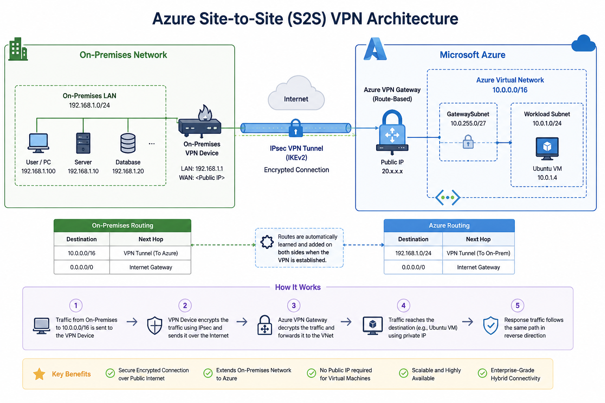

# Azure Site-to-Site (S2S) VPN — Connecting On-Premises Network to Azure

Enterprise-style implementation of an Azure **Site-to-Site VPN**, establishing a persistent, encrypted **IPsec/IKE tunnel** between an on-premises network and an Azure Virtual Network — enabling secure, private communication between the two environments without traversing the public Internet in plaintext.



## Overview

Unlike Point-to-Site (P2S), which connects a *single device* to Azure, Site-to-Site VPN connects an entire **on-premises network** to an Azure VNet through a gateway-to-gateway tunnel. Any device on the on-prem network can reach resources in Azure (and vice versa) once the tunnel is established — no per-device VPN client required.

```
On-Premises Network ⇄ VPN Device ⇄ IPsec Tunnel ⇄ Azure VPN Gateway ⇄ Azure VNet
```

## Deployment Flow

```
1. Create Virtual Network (VNet)
            │
            ▼
2. Create GatewaySubnet
            │
            ▼
3. Deploy Azure VPN Gateway
            │
            ▼
4. Create Local Network Gateway
   (On-prem Public IP + Address Space)
            │
            ▼
5. Create VPN Connection
   (Configure Shared Key / PSK)
            │
            ▼
6. Configure On-Premises VPN Device
            │
            ▼
7. IPsec Tunnel Established
            │
            ▼
Azure VNet ⇄ Secure Communication ⇄ On-Premises Network
```

## Why This Matters

| Without S2S VPN | With S2S VPN |
|---|---|
| On-prem and Azure resources can't communicate privately | Full network-to-network private connectivity |
| Each user needs their own VPN client | Entire on-prem network shares one gateway tunnel |
| Data to Azure often crosses the public Internet unencrypted | Traffic is encrypted end-to-end via IPsec/IKE |
| No central place to manage the connection | Single gateway-to-gateway connection to manage and monitor |

## Architecture Components

- **Virtual Network (VNet)** – Azure-side private address space
- **GatewaySubnet** – reserved subnet required to host the Azure VPN Gateway
- **Azure VPN Gateway** – Azure-side endpoint of the IPsec tunnel
- **Local Network Gateway** – represents the on-premises side: its public IP and on-prem address range(s), as seen from Azure
- **Connection (Shared Key / PSK)** – the logical S2S connection linking the Azure VPN Gateway and Local Network Gateway, secured with a pre-shared key
- **On-Premises VPN Device** – physical or virtual appliance (e.g. firewall/router) configured to match the Azure-side tunnel parameters
- **IPsec Tunnel** – the encrypted channel carrying traffic between both networks once negotiation succeeds

## Configuration Reference

| Parameter | Example Value | Purpose |
|---|---|---|
| Gateway Type | VPN | Site-to-Site connectivity type |
| VPN Type | Route-Based | Required for most S2S scenarios |
| Connection Type | IPsec (Site-to-Site) | Defines the connection as gateway-to-gateway |
| Azure VNet | `10.0.0.0/16` | Azure-side private address space |
| Gateway Subnet | `10.0.255.0/27` | Reserved subnet for the VPN Gateway |
| On-Prem Address Space | e.g. `192.168.0.0/16` | Address range advertised by the Local Network Gateway |
| On-Prem Public IP | Static public IP of on-prem device | Required — must not change after configuration |
| IKE Version | IKEv2 | Key exchange protocol version |
| Shared Key (PSK) | Strong random string | Pre-shared key securing the tunnel; must match on both sides |

## Repository Structure

```
├── README.md              # This file
├── Architecture.png       # Architecture diagram
├── Deployment-Steps.md    # Full step-by-step deployment guide
└── Screenshots/           # Validation evidence (gateway, connection status, connectivity test)
```

## Validation

The `Screenshots/` folder contains proof of a working deployment:
- Azure VPN Gateway overview showing provisioning succeeded
- Connection resource showing status **Connected**
- On-prem device VPN tunnel status (up/established)
- Successful ping or connectivity test between on-prem and Azure resources

## Skills Demonstrated

Azure Networking · Virtual Network design · Site-to-Site VPN Gateway configuration · Local Network Gateway setup · IPsec/IKE tunneling · Pre-shared key security · Route-based routing · Hybrid network connectivity

## Future Enhancements

- Active-Active gateway configuration for higher availability
- BGP for dynamic route exchange instead of static address spaces
- ExpressRoute as a dedicated, non-Internet alternative
- Multiple Local Network Gateways for multi-site connectivity
- Hub-Spoke topology with Azure Virtual WAN
- Combining S2S with P2S for hybrid remote-access scenarios

## Author

**Deepak Patra**
IT & Cloud Engineering | AZ-700 · AZ-104 · AZ-305
